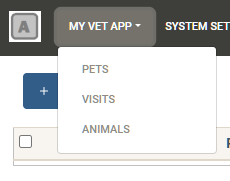

Creating an app
=================

For this tutorial, we will create a Vet app. The requirements of this app are:

* Pets are to be registered. Pets have a name and are a certain kind of animal (selectable from a catalogue of animals).
* New kinds of animals can be added to the catalogue as needed.
* Each visit to the vet is to be recorded.
* Each visit is associated with a previously registered Pet, and certain information about the visit is asked: the date, and notes about the visit.

The script ``new_app`` automatizes the steps needed to create an app. It creates the needed
folder structure and also creates a file with blank configuration variables for you to fill
out (the name of this file will the app name prefixed by a dot). Run the script and pass the
desired app name as its sole argument.

.. code-block:: text

    ./new_app vet

This will create the folder ``apps/vet/``, and a configuration file ``.vet``. Enter the credentials for a
PostgreSQL instance in the ``.vet`` file.

.. code-block:: text

    flr_app=vet
    flr_app_title=My Vet App
    flr_db_name=vet_app
    flr_db_host=localhost
    flr_db_user=mypostgresuser
    flr_db_pass=mysecretpassword

You can also change the ``flr_admin_pass`` value to whatever you like or leave it like that.
It is the password used to log in as admin.

.. code-block:: text

    flr_admin_pass=VerySecretPassword

Defining models
------------------

For this app we'll need an ``Animal`` model, a ``Pet`` model and a ``Visit`` model.
Models are written using the Peewee ORM. Refer to `Peewee's documentation`_ for an in-depth
explanation of the ORM features 

.. _Peewee's documentation: http://docs.peewee-orm.com/en/latest/

All models must inherit flr's ``BaseModel`` (which in turn inherits from the Peewee Model but
with some flr-specific boilerplate added).

For this app we will put all three models in the same file. Create the file ``models/vet.py``

models/vet.py

.. code-block:: python

    import peewee as pw
    from flr import BaseModel

    class Animal(BaseModel):
        name = pw.CharField(verbose_name="Animal name")

    Animal.r()

    class Pet(BaseModel):
        name = pw.CharField(verbose_name="Pet's name")
        animal = pw.ForeignKeyField(Animal, verbose_name="Animal")

    Pet.r()

    class Visit(BaseModel):
        pet = pw.ForeignKeyField(Pet, verbose_name="Pet")
        visit_date = pw.DateField(verbose_name="Visit date")
        notes = pw.TextField(verbose_name="Notes", null=True)

    Visit.r()

The ``verbose_name`` parameter is optional. It will be used as the label for that field in
forms, and as the column header in list views. Otherwise the label will be derived from the
field name itself. Notice that by default all fields will be not-null unless you pass
``null=True``. Also notice the ``r()`` call after each model definition (this calls a
routine that, among other things, adds the class to a Registry dictionary
that can be imported from anywhere and thus give you access to any model from any file.
For more information see ___).

Don't forget to add the models to the init file so they are imported when the app runs.

models/__init__.py

.. code-block:: python

    from . import vet

We can now start the server. Use the provided script ``run.sh``.

.. code-block:: text

    ./run.sh vet

When prompted enter yes to create the necessary tables in the database.
However, if you now navigate to ``localhost:6800`` and log in (user: admin, password: the one
defined in the ``flr_admin_pass`` variable) you won't see these models anywhere yet!
This is because there's one more step needed, and thats defining the menus and views.

Defining views
-------------------

Views are defined using JSON files. Any JSON file placed inside the ``data/`` folder
(already created by the ``new_app`` script) will be loaded at server startup.
Each of these files is expected to contain a list of objects, each object being a record
to be inserted in the database. The general structure of each of these objects is 

.. code-block:: json

    {
        "model": string,
        "meta_id": string,
        "data": object
    }

The ``model`` property indicates into which table the record must be inserted. It must be
a string corresponding to the name of a Model. The ``meta_id`` property is a string which
will function as an user-defined id to the record that is being created. This allows for
records to be referenced by one another without depending on the actual id they have inside
the database table, and also allows for the records to be recognized with each successive
server startup. This way, on successive startups, records won't be actually created again,
just maybe updated. Finally, the ``data`` property consists of an object containing the
record's desired values.

Each section, menu, and view is actually just a regular record in the database.  Sections
are defined by the ``FlrSection`` model, menus by the ``FlrMenu`` model, and views by
the ``FlrView`` model. We will create a single section called "My Vet App" which will contain 
the following menus: "Pets", "Visits" and "Animals". Create the file ``data/menus.json``.

data/menus.json

.. code-block:: json

    [
        {
            "model": "FlrMenuSection",
            "meta_id": "section_vet",
            "data": {
                "name": "My Vet App",
                "sequence": 1
            }
        },
        {
            "model": "FlrMenu",
            "meta_id": "menu_pets",
            "data": {
                "name": "Pets",
                "sequence": 1,
                "section_id_META_ID": "section_vet"
            }
        },
        {
            "model": "FlrMenu",
            "meta_id": "menu_visits",
            "data": {
                "name": "Visits",
                "sequence": 2,
                "section_id_META_ID": "section_vet"
            }
        },
        {
            "model": "FlrMenu",
            "meta_id": "menu_animals",
            "data": {
                "name": "Animals",
                "sequence": 3,
                "section_id_META_ID": "section_vet"
            }
        }
    ]

Now, for the menus to actually do something when clicked we must define the views. Each menu
can open one or more views. Normally we want it to open both the list and the form view, but
it can be just the list view or just the form view if desired. Each view definition describes
the fields to be shown and their layout. List view definitions basically are just a list of fields,
but the definition of form views can be a little more intricate, as it can be divided into
several sections and contain action buttons. Each field can be further configured (for example,
to override its default label or mark it as required). See ___ to learn all the possible options
that can be passed to fields.

Create the file ``data/views.json``

data/views.json

.. code-block:: json

    [
        {
            "model": "FlrView",
            "meta_id": "animal_list_view",
            "data": {
                "name": "Animal list view",
                "model": "Animal",
                "view_type": "list",
                "definition": {
                    "structure": [
                        {"field": "name"}
                    ]
                },
                "menu_id_META_ID": "menu_animals",
                "sequence": 1
            }
        },
        {
            "model": "FlrView",
            "meta_id": "animal_form_view",
            "data": {
                "name": "Animal form view",
                "model": "Animal",
                "view_type": "form",
                "definition": {
                    "structure": [
                        {"field": "name"}
                    ]
                },
                "menu_id_META_ID": "menu_animals",
                "sequence": 2
            }
        },
        {
            "model": "FlrView",
            "meta_id": "pet_list_view",
            "data": {
                "name": "Pet list view",
                "model": "Pet",
                "view_type": "list",
                "definition": {
                    "structure": [
                        {"field": "name"},
                        {"field": "animal"}
                    ]
                },
                "menu_id_META_ID": "menu_pets",
                "sequence": 1
            }
        },
        {
            "model": "FlrView",
            "meta_id": "pet_form_view",
            "data": {
                "name": "Pet form view",
                "model": "Pet",
                "view_type": "form",
                "definition": {
                    "structure": [
                        {"field": "name"},
                        {"field": "animal"}
                    ]
                },
                "menu_id_META_ID": "menu_pets",
                "sequence": 2
            }
        },
        {
            "model": "FlrView",
            "meta_id": "visit_list_view",
            "data": {
                "name": "Visit list view",
                "model": "Visit",
                "view_type": "list",
                "definition": {
                    "structure": [
                        {"field": "pet"},
                        {"field": "visit_date"},
                        {"field": "notes"}
                    ]
                },
                "menu_id_META_ID": "menu_visits",
                "sequence": 1
            }
        },
        {
            "model": "FlrView",
            "meta_id": "visit_form_view",
            "data": {
                "name": "Visit form view",
                "model": "Visit",
                "view_type": "form",
                "definition": {
                    "structure": [
                        {"field": "pet"},
                        {"field": "visit_date"},
                        {"field": "notes"}
                    ]
                },
                "menu_id_META_ID": "menu_visits",
                "sequence": 2
            }
        }
    ]

We can also load some initial data in our database, for example let's add some animals to the Animal
catalogue. Create the file ``data/animals.json``.

data/animals.json

.. code-block:: json

    [
        {
            "model":"Animal",
            "meta_id": "animal_dog",
            "data": {
                "name": "Dog"
            }
        },
        {
            "model":"Animal",
            "meta_id": "animal_cat",
            "data": {
                "name": "Cat"
            }
        }
    ]

Now stop and run the server again. The menus and views will be loaded into the database.
Go to ``localhost:6800`` and you will now see the "My Vet App" section. 

And that's it! The application is now fully functional, new records can be created, and existing
ones can be edited and deleted.

NOTE: the files present in the ``data/`` folder will be loaded in alphabetical order.

Logos and custom styles
-------------------------

You may have noticed that there is a generic logo both in the login screen and in the navbar. 
To use your own logos, place your images in the ``public/`` folder. The files must be named
``logo.png`` and ``logo_navbar.png``. 

You can change the overall theme of the application by editing or replacing the ``bootstrap.min.css`` file.
The default file is a theme from https://bootswatch.com/. You can download any other and overwrite it.

You can also include a file named ``global.css`` with any rules you like.

