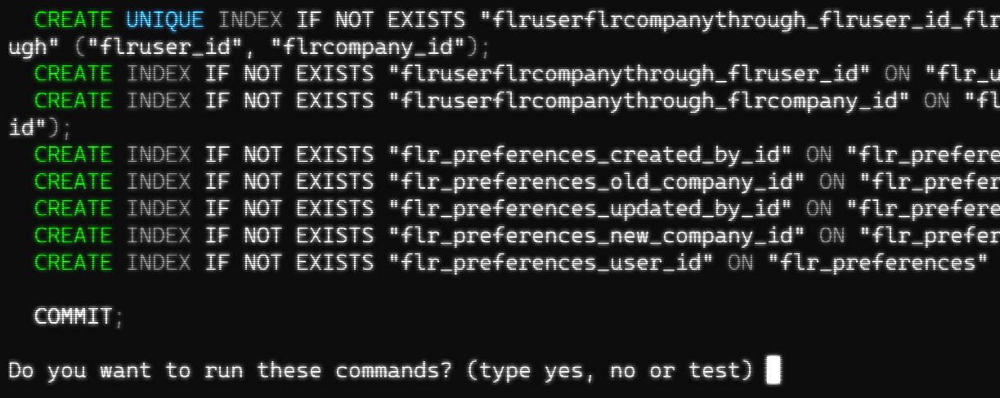
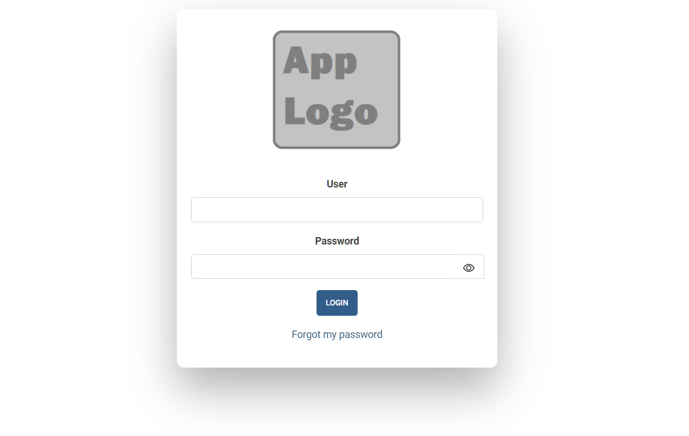
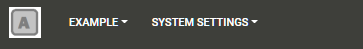
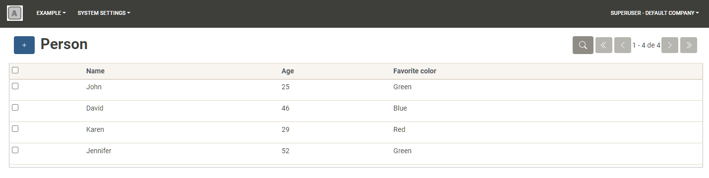
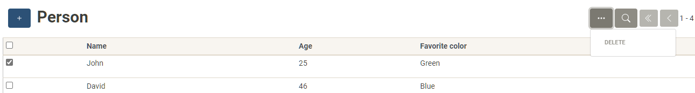
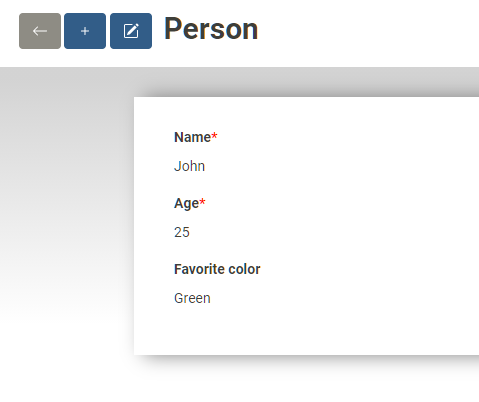
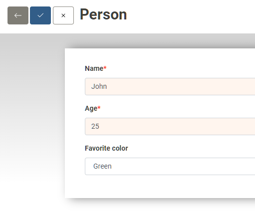
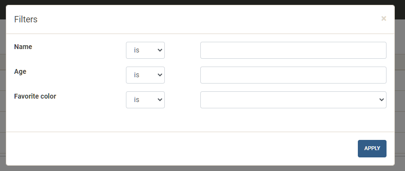

Getting Started
===============

Installation
--------------------------
Download flr and install the Python dependencies, which are provided in the requirements.txt file.

.. code-block:: text

    git clone https://github.com/julianss/flr.git
    cd flr
    pip3 install -r requirements.txt

Compile the frontend app.

.. code-block:: text

    cd svelte_client
    npm install
    npm run build


Run the example app
--------------------------
Apps are located in the ``apps/`` folder. We will now run the included ``example`` app.
Every app should have a corresponding configuration file containing the environment variables
necesssary for running it. Edit the ``.example`` file to provide the necessary
credentials to a PostgreSQL instance. 

.. code-block:: text

    flr_app=example
    flr_db_name=example
    flr_db_user=youruser
    flr_db_pass=yourpassword
    flr_db_host=localhost
    flr_db_port=5432

Run the server by executing the ``run.sh``  script passing as argument the name of the configuration file without the dot. 

.. code-block:: text

    ./run.sh example

If the Postgres user you provided has database creation privileges, the database will be automatically
created. If not, you must ensure the database exists before running flr.

If the database connection is successful, you will be prompted with a bunch of SQL commands.



Type "yes" and enter. This will create the database tables. When it's done point your browser
to ``localhost:6800`` to open the app. You will see the login screen.



The default user is admin, and the password is also admin (this password can be changed
through the env variable ``flr_admin_pass``).

Web client overview
--------------------------
Menus and views
````````````````````
The web client consists of sections, menus and views. A section is each different link that appears
in the topbar. 



When clicked, a section displays a dropdown menu of options. Each of this options is
called a menu, and each menu opens a different view or set of views.

.. image:: img/person.PNG
  :width: 300

Views come in different flavors:


List view
^^^^^^^^^^^^^
The list view shows a list of paged records. It can be filtered to show only records that satisfy
certain criteria.



Records can be selected by clicking the checkboxs to the left, in order to execute
actions on them (such as delete them).



To view and edit a record, click on a row. To create a new record click on the New button (plus icon).
Both of these actions will open the form view.


Form view
^^^^^^^^^^^^^
The form view shows the record's fields in detail.



Click the edit button to activate the edit mode wherein the fields become editable and the
record can be updated.



The Form view renders each field according to its type. Hence it will render
Date fields as a date input, Boolean fields as a checkbox and so on.

Search view
^^^^^^^^^^^^^
This is a dialog used to filter the list view, where values and conditions for each field
can be specified. Open it by clicking the magnifying glass icon in the List View.




